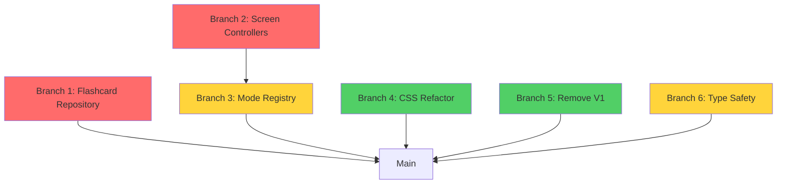

# Independent Branch Plans for Remaining Design Flaws

This document outlines detailed, independent branch strategies for addressing each remaining design flaw. Each branch is self-contained and can be developed in parallel.

---

## Branch 1: `feature/flashcard-progress-repository`

**Flaw Addressed:** Dual Persistence Pattern (Complete localStorage migration)

**Priority:** P0 (Critical)

**Estimated Effort:** 3-4 hours

### Objective
Create FlashcardProgressRepository to track flashcard mastery levels using spaced repetition algorithm, completing the localStorage to database migration.

### Prerequisites
- ✓ DatabaseService implemented
- ✓ MigrationService created
- ✓ Base repository pattern established

### Technical Design

#### 1. Database Schema
```sql
CREATE TABLE IF NOT EXISTS flashcard_progress (
    id INTEGER PRIMARY KEY AUTOINCREMENT,
    player_id INTEGER NOT NULL,
    subject_id TEXT NOT NULL,
    flashcard_id TEXT NOT NULL,
    mode TEXT NOT NULL, -- 'term' or 'bank'
    mastery_level INTEGER DEFAULT 0, -- 0-5 scale
    last_reviewed INTEGER, -- timestamp
    next_review INTEGER, -- timestamp (spaced repetition)
    review_count INTEGER DEFAULT 0,
    correct_count INTEGER DEFAULT 0,
    incorrect_count INTEGER DEFAULT 0,
    created_at INTEGER DEFAULT (strftime('%s', 'now')),
    updated_at INTEGER DEFAULT (strftime('%s', 'now')),
    UNIQUE(player_id, subject_id, flashcard_id, mode),
    FOREIGN KEY (player_id) REFERENCES player(id) ON DELETE CASCADE
);

CREATE INDEX idx_flashcard_progress_player ON flashcard_progress(player_id);
CREATE INDEX idx_flashcard_progress_subject ON flashcard_progress(subject_id);
CREATE INDEX idx_flashcard_progress_next_review ON flashcard_progress(next_review);
```

#### 2. Repository Interface
```typescript
interface FlashcardProgress {
    id: number;
    playerId: number;
    subjectId: string;
    flashcardId: string;
    mode: 'term' | 'bank';
    masteryLevel: number; // 0-5
    lastReviewed: number;
    nextReview: number;
    reviewCount: number;
    correctCount: number;
    incorrectCount: number;
}

class FlashcardProgressRepository {
    // Core CRUD
    async getProgress(playerId, subjectId, flashcardId, mode): Promise<FlashcardProgress | null>
    async updateProgress(data: FlashcardProgress): Promise<void>
    async recordReview(playerId, subjectId, flashcardId, mode, isCorrect): Promise<void>
    
    // Spaced Repetition
    async getDueCards(playerId, subjectId, mode): Promise<FlashcardProgress[]>
    async calculateNextReview(currentLevel, isCorrect): number
    
    // Analytics
    async getSubjectMastery(playerId, subjectId): Promise<number> // 0-100%
    async getCardsByMastery(playerId, subjectId, level): Promise<FlashcardProgress[]>
}
```

#### 3. Spaced Repetition Algorithm
```typescript
// SM-2 Algorithm (simplified)
calculateNextReview(currentLevel: number, isCorrect: boolean): number {
    const now = Date.now();
    let newLevel = currentLevel;
    
    if (isCorrect) {
        newLevel = Math.min(currentLevel + 1, 5);
    } else {
        newLevel = Math.max(currentLevel - 1, 0);
    }
    
    // Intervals: 1m, 10m, 1h, 1d, 3d, 1w
    const intervals = [60, 600, 3600, 86400, 259200, 604800];
    const intervalSeconds = intervals[newLevel] || 604800;
    
    return now + (intervalSeconds * 1000);
}
```

### Implementation Steps

#### Step 1: Create Repository
- [ ] Create `src/infrastructure/db/repositories/FlashcardProgressRepository.ts`
- [ ] Implement all CRUD methods
- [ ] Add spaced repetition logic
- [ ] Write unit tests

#### Step 2: Database Migration
- [ ] Add schema to `src/infrastructure/db/schema.sql`
- [ ] Update `DatabaseService.initSchema()` to create table
- [ ] Add migration logic to `MigrationService.migrate()`
  - Read `fc_term_*` and `fc_bank_*` keys from localStorage
  - Convert to database records
  - Preserve mastery levels

#### Step 3: Update FlashcardScreen
- [ ] Import FlashcardProgressRepository
- [ ] Replace `localStorage.setItem(key, val)` with `recordReview()`
- [ ] Load progress from database instead of localStorage
- [ ] Show mastery indicators in UI

#### Step 4: Add Analytics
- [ ] Create mastery overview component
- [ ] Show cards by mastery level (beginner, learning, mastered)
- [ ] Add "Study Due Cards" button

### Testing Checklist
- [ ] Migration preserves existing flashcard progress
- [ ] Spaced repetition schedules cards correctly
- [ ] Mastery level updates on correct/incorrect answers
- [ ] Performance test with 1000+ flashcard records
- [ ] UI shows mastery indicators

### Files to Modify
- `src/infrastructure/db/repositories/FlashcardProgressRepository.ts` (new)
- `src/infrastructure/db/schema.sql`
- `src/infrastructure/db/DatabaseService.ts`
- `src/infrastructure/db/MigrationService.ts`
- `src/ui/screens/practice-screens/FlashcardScreen.astro`

### Success Criteria
- Zero localStorage references for flashcard data
- Spaced repetition works correctly
- Migration preserves all user progress
- Mastery levels visible in UI

---

## Branch 2: `refactor/screen-controllers-migration`

**Flaw Addressed:** Window Object Pollution + Component Initialization

**Priority:** P1 (High)

**Estimated Effort:** 8-10 hours

### Objective
Migrate all remaining screen controllers to use BaseScreenController and componentRegistry pattern, eliminating window.game pollution and initialization race conditions.

### Screens to Migrate (6 total)
1. BlitzScreen.astro
2. HardcoreScreen.astro
3. ExamScreen.astro
4. PracticeScreen.astro
5. RevisionScreen.astro (full-revision mode)
6. ResultsScreen.astro

### Per-Screen Migration Template

#### Phase 1: Setup (15 mins per screen)
```bash
# Backup original
cp src/ui/screens/challenge-screens/BlitzScreen.astro \
   src/ui/screens/challenge-screens/BlitzScreen.astro.backup

# Run migration script
python scripts/migrate_screen_to_base_controller.py \
    src/ui/screens/challenge-screens/BlitzScreen.astro
```

#### Phase 2: Extend BaseScreenController (30 mins per screen)
```typescript
// Before
class BlitzController {
    constructor() {
        window.addEventListener('load', () => this.tryInit());
    }
    
    tryInit() {
        // Polling logic for components...
        const interval = setInterval(() => {
            this.header = document.getElementById('header')?.headerInstance;
            // ...
        }, 100);
    }
}

// After
class BlitzController extends BaseScreenController {
    constructor() {
        super('blitz-screen');
    }
    
    async onInit(): Promise<void> {
        // Get components from registry (no polling)
        this.header = componentRegistry.get('blitz-header');
        this.footer = componentRegistry.get('blitz-footer');
        
        if (!this.header || !this.footer) {
            console.error('[BlitzScreen] Required components missing');
            return;
        }
        
        this.subscribeToEvents();
        this.registerMethods();
    }
}
```

#### Phase 3: Replace window.game (1 hour per screen)
```typescript
// Before
bindEvents() {
    window.game = window.game || {};
    window.game.startBlitz = this.start.bind(this);
}

// After
registerMethods() {
    // Primary: Use componentRegistry
    componentRegistry.register('blitz-controller', {
        start: () => this.start(),
        pause: () => this.pause(),
        resume: () => this.resume(),
        screen: this.screenId,
    });
    
    // Backward compatibility (temporary)
    // @ts-ignore
    window.game = window.game || {};
    // @ts-ignore
    window.game.startBlitz = () => {
        console.warn('[Deprecated] Use componentRegistry.get("blitz-controller").start()');
        this.start();
    };
}
```

#### Phase 4: Update Event System (30 mins per screen)
```typescript
// Before
window.dispatchEvent(new CustomEvent('game:complete', { detail: data }));

// After
await eventBus.emit('game:complete', data);
```

#### Phase 5: Update HomeScreen Caller (centralized, 1 hour total)
```typescript
// Before (in HomeScreen)
switch(this.currentMode) {
    case 'blitz':
        if (window.game.startBlitz) window.game.startBlitz();
        break;
    // ... 7 more cases
}

// After
const controllerMap = {
    'speedrun': 'speedrun-controller',
    'blitz': 'blitz-controller',
    'hardcore': 'hardcore-controller',
    'exam': 'exam-controller',
    'practice': 'practice-controller',
    'flashcards-term': 'flashcard-controller',
    'flashcards-bank': 'flashcard-controller',
    'full-revision': 'revision-controller'
};

const controllerId = controllerMap[this.currentMode];
if (controllerId) {
    const controller = componentRegistry.get(controllerId);
    if (controller && controller.start) {
        controller.start();
    } else {
        console.error(`[HomeScreen] Controller not found: ${controllerId}`);
    }
}
```

### Implementation Schedule (Parallel Work Possible)

**Week 1: Challenge Screens (3 screens)**
- Day 1: BlitzScreen.astro
- Day 2: HardcoreScreen.astro
- Day 3: ExamScreen.astro

**Week 2: Practice/Revision Screens (3 screens)**
- Day 4: PracticeScreen.astro
- Day 5: RevisionScreen.astro (full-revision)
- Day 6: ResultsScreen.astro

**Week 2: Integration & Cleanup**
- Day 7: Update HomeScreen controller map
- Day 8: Remove backward compatibility shims
- Day 9: Testing & polish

### Automated Script Usage
```bash
# For each screen:
python scripts/migrate_screen_to_base_controller.py src/ui/screens/challenge-screens/BlitzScreen.astro
# Review generated report
# Apply manual changes
# Test screen

# After all screens migrated:
python scripts/remove_window_game_pollution.py --report window_game_final_report.md
# Verify zero window.game usage
```

### Testing Checklist (Per Screen)
- [ ] Screen loads without errors
- [ ] All components initialize correctly
- [ ] GameEngine starts and runs properly
- [ ] Events are emitted and received
- [ ] Results screen shows correctly
- [ ] Navigation works (back to home, restart)
- [ ] No console errors or warnings

### Files to Modify (Per Screen)
- Screen file (e.g., `BlitzScreen.astro`)
- HomeScreen.astro (update controller map)
- Test file (create if missing)

### Success Criteria
- All 6 screens extend BaseScreenController
- Zero window.game assignments (except deprecated warnings)
- ComponentRegistry used for all inter-component communication
- All tests pass
- Performance improved (no polling intervals)

---

## Branch 3: `refactor/homescreen-controller-registry`

**Flaw Addressed:** Hard-coded Mode Mapping

**Priority:** P2 (Medium)

**Estimated Effort:** 2-3 hours

### Objective
Replace HomeScreen's switch statement with a dynamic controller registry pattern, making it easy to add new game modes without modifying HomeScreen code.

### Current Problem
```typescript
// HomeScreen.astro - 50+ lines of switch cases
switch(this.currentMode) {
    case 'speedrun': if(game.startSpeedrun) game.startSpeedrun(); break;
    case 'blitz': if(game.startBlitz) game.startBlitz(); break;
    case 'hardcore': if(game.startHardcore) game.startHardcore(); break;
    case 'exam': if(game.startExam) game.startExam(); break;
    case 'practice': if(game.startPractice) game.startPractice(); break;
    case 'flashcards-term': if(game.startFlashcardsTerm) game.startFlashcardsTerm(); break;
    case 'flashcards-bank': if(game.startFlashcardsBank) game.startFlashcardsBank(); break;
    case 'full-revision': if(game.startFullRevision) game.startFullRevision(); break;
}
```

### Solution Design

#### 1. Create Mode Registry
```typescript
// src/ui/registry/ModeRegistry.ts
export interface ModeController {
    controllerId: string;
    screenId: string;
    icon: string;
    label: string;
    description: string;
    start: () => Promise<void>;
}

export class ModeRegistry {
    private static instance: ModeRegistry;
    private modes: Map<string, ModeController> = new Map();
    
    static getInstance(): ModeRegistry {
        if (!this.instance) {
            this.instance = new ModeRegistry();
        }
        return this.instance;
    }
    
    register(modeId: string, controller: ModeController) {
        this.modes.set(modeId, controller);
    }
    
    get(modeId: string): ModeController | undefined {
        return this.modes.get(modeId);
    }
    
    getAll(): ModeController[] {
        return Array.from(this.modes.values());
    }
    
    getAllByCategory(category: 'challenge' | 'practice'): ModeController[] {
        // Filter by category if needed
        return this.getAll();
    }
}

export const modeRegistry = ModeRegistry.getInstance();
```

#### 2. Register Modes in Each Screen
```typescript
// SpeedrunScreen.astro
async onInit(): Promise<void> {
    // ... existing init code ...
    
    // Register mode
    modeRegistry.register('speedrun', {
        controllerId: 'speedrun-controller',
        screenId: 'speedrun-screen',
        icon: '⚡',
        label: 'Speedrun',
        description: 'Answer as many questions as possible before time runs out',
        start: async () => {
            await this.startChallenge();
        }
    });
}
```

#### 3. Simplify HomeScreen
```typescript
// HomeScreen.astro
async selectMode(mode: string) {
    this.currentMode = mode;
    
    // Simple lookup instead of switch
    const modeController = modeRegistry.get(mode);
    
    if (!modeController) {
        console.error(`[HomeScreen] Mode not found: ${mode}`);
        return;
    }
    
    try {
        await modeController.start();
    } catch (error) {
        console.error(`[HomeScreen] Error starting ${mode}:`, error);
        this.showError(`Failed to start ${mode}`);
    }
}
```

#### 4. Dynamic Mode Grid (Bonus)
```typescript
// Generate mode buttons dynamically
renderModeGrid() {
    const modes = modeRegistry.getAllByCategory('challenge');
    const grid = document.getElementById('mode-grid');
    
    if (!grid) return;
    
    grid.innerHTML = modes.map(mode => `
        <button 
            class="mode-card" 
            onclick="window.game.selectMode('${mode.controllerId}')"
        >
            <span class="mode-icon">${mode.icon}</span>
            <h3>${mode.label}</h3>
            <p>${mode.description}</p>
        </button>
    `).join('');
}
```

### Implementation Steps

#### Step 1: Create Mode Registry
- [ ] Create `src/ui/registry/ModeRegistry.ts`
- [ ] Implement registration and lookup methods
- [ ] Add TypeScript interfaces

#### Step 2: Update Each Screen Controller
- [ ] SpeedrunScreen: Register mode in `onInit()`
- [ ] BlitzScreen: Register mode
- [ ] HardcoreScreen: Register mode
- [ ] ExamScreen: Register mode
- [ ] PracticeScreen: Register mode
- [ ] FlashcardScreen: Register both term and bank modes
- [ ] RevisionScreen: Register full-revision mode

#### Step 3: Refactor HomeScreen
- [ ] Replace switch statement with registry lookup
- [ ] Add error handling
- [ ] Update mode selection logic
- [ ] (Optional) Generate mode grid dynamically

#### Step 4: Update Mode Selector Component
- [ ] Update `ModeSelector.astro` to use registry data
- [ ] Make icons/labels configurable
- [ ] Add mode filtering (challenge vs practice)

### Testing Checklist
- [ ] All 8 modes can be started from HomeScreen
- [ ] Error handling works for invalid modes
- [ ] Mode metadata (icons, labels) displays correctly
- [ ] New modes can be added without changing HomeScreen
- [ ] No regression in existing functionality

### Files to Modify
- `src/ui/registry/ModeRegistry.ts` (new)
- `src/ui/screens/HomeScreen.astro`
- All screen controllers (7 files)
- `src/ui/components/modules/ModeSelector.astro` (optional)

### Success Criteria
- Zero switch/case statements for mode selection
- All modes registered in ModeRegistry
- HomeScreen code reduced by 30+ lines
- Adding new mode requires only registering it in new screen file

---

## Branch 4: `chore/css-refactor-utility-classes`

**Flaw Addressed:** CSS Duplication & Specificity

**Priority:** P3 (Low)

**Estimated Effort:** 6-8 hours

### Objective
Refactor 1100+ line global.css into modular, maintainable CSS with utility classes and component-scoped styles.

### Current Problems
- 1100+ lines in single file
- Deep nesting (`.screen .container .card .button`)
- Repeated patterns (margins, padding, colors)
- Screen-specific overrides scattered across files
- Large bundle size

### Solution Strategy

#### 1. Extract Utility Classes
```css
/* utilities.css - Common utilities */
.flex { display: flex; }
.flex-col { flex-direction: column; }
.items-center { align-items: center; }
.justify-between { justify-content: space-between; }
.gap-1 { gap: 0.25rem; }
.gap-2 { gap: 0.5rem; }
.gap-4 { gap: 1rem; }

.p-1 { padding: 0.25rem; }
.p-2 { padding: 0.5rem; }
.p-4 { padding: 1rem; }
.px-4 { padding-left: 1rem; padding-right: 1rem; }
.py-2 { padding-top: 0.5rem; padding-bottom: 0.5rem; }

.text-sm { font-size: 0.875rem; }
.text-base { font-size: 1rem; }
.text-lg { font-size: 1.125rem; }
.font-bold { font-weight: 700; }
```

#### 2. Component-Scoped Styles
```astro
<!-- SpeedrunScreen.astro -->
<style scoped>
    .screen {
        /* Only speedrun-specific styles */
    }
</style>
```

#### 3. CSS Modules Structure
```
src/styles/
├── base/
│   ├── reset.css          (normalize, box-sizing)
│   ├── typography.css     (font-family, sizes, weights)
│   └── variables.css      (CSS custom properties)
├── utilities/
│   ├── layout.css         (flex, grid utilities)
│   ├── spacing.css        (margin, padding)
│   └── colors.css         (bg, text, border colors)
├── components/
│   ├── button.css
│   ├── card.css
│   ├── modal.css
│   └── badge.css
└── screens/
    ├── home.css
    ├── speedrun.css
    └── results.css
```

### Implementation Steps

#### Step 1: Analyze Current CSS (1 hour)
```bash
# Use script to analyze CSS
python scripts/analyze_css.py src/styles/global.css

# Output:
# - Most used selectors
# - Repeated patterns
# - Specificity issues
# - Suggested utilities
```

#### Step 2: Extract Variables (1 hour)
```css
/* src/styles/base/variables.css */
:root {
    /* Colors (Neo-Brutalist palette) */
    --color-primary: #000000;
    --color-secondary: #ffffff;
    --color-accent: #ff6b6b;
    --color-success: #51cf66;
    --color-warning: #ffd43b;
    --color-error: #ff6b6b;
    
    /* Spacing scale */
    --space-1: 0.25rem;
    --space-2: 0.5rem;
    --space-3: 0.75rem;
    --space-4: 1rem;
    --space-6: 1.5rem;
    --space-8: 2rem;
    
    /* Typography */
    --font-sans: 'Inter', sans-serif;
    --font-mono: 'Roboto Condensed', monospace;
    
    /* Shadows (hard, neo-brutalist) */
    --shadow-sm: 2px 2px 0 var(--color-primary);
    --shadow-md: 4px 4px 0 var(--color-primary);
    --shadow-lg: 8px 8px 0 var(--color-primary);
}
```

#### Step 3: Create Utility Classes (2 hours)
- Extract flex/grid patterns
- Create spacing utilities
- Create typography utilities
- Create color utilities

#### Step 4: Refactor Components (3 hours)
- Move button styles to `components/button.css`
- Move card styles to `components/card.css`
- Apply utility classes to HTML
- Remove duplicated code

#### Step 5: Split Screen Styles (1 hour)
- Move screen-specific CSS to screen files
- Use `<style scoped>` in Astro components
- Import only needed utilities

#### Step 6: Update Build Process (30 mins)
```javascript
// astro.config.mjs
export default {
    vite: {
        css: {
            preprocessorOptions: {
                scss: {
                    // If using SCSS
                }
            }
        }
    }
}
```

### Testing Checklist
- [ ] All screens render correctly
- [ ] No visual regressions
- [ ] CSS bundle size reduced
- [ ] No unused CSS (run PurgeCSS)
- [ ] Lighthouse CSS score improved

### Files to Create
- `src/styles/base/variables.css`
- `src/styles/base/reset.css`
- `src/styles/base/typography.css`
- `src/styles/utilities/layout.css`
- `src/styles/utilities/spacing.css`
- `src/styles/utilities/colors.css`
- `src/styles/components/*.css`

### Files to Modify
- `src/styles/global.css` (reduce from 1100 to ~200 lines)
- All screen `.astro` files (add scoped styles)
- `src/layouts/Layout.astro` (import modular CSS)

### Success Criteria
- global.css under 300 lines
- 50%+ reduction in CSS bundle size
- Zero duplicated utility patterns
- Lighthouse CSS score 90+
- All components use utility classes

---

## Branch 5: `chore/remove-mold-v1-legacy`

**Flaw Addressed:** V1 Legacy Code Coexistence

**Priority:** P4 (Low)

**Estimated Effort:** 1 hour

### Objective
Archive and remove MoldV1 legacy code after verifying V2 feature parity.

### Implementation Steps

#### Step 1: Feature Parity Verification
Create checklist comparing V1 vs V2:
```markdown
# V1 vs V2 Feature Parity

## Game Modes
- [x] Speedrun - V2 implemented
- [x] Blitz - V2 implemented  
- [x] Hardcore - V2 implemented
- [x] Exam - V2 implemented
- [x] Practice - V2 implemented
- [x] Flashcards (Term) - V2 implemented
- [x] Flashcards (Bank) - V2 implemented
- [x] Full Revision - V2 implemented

## Features
- [x] Player stats - V2 has database-backed stats
- [x] Achievements - V2 has AchievementRepository
- [x] History tracking - V2 has GameHistoryRepository
- [x] Settings panel - V2 has GameSettingsPanel
- [ ] Leaderboard - Not in V2 (add to backlog)

## Data Persistence
- [x] V2 uses SQLite (better than V1 localStorage)
- [x] Migration preserves V1 data
```

#### Step 2: Archive V1
```bash
# Create archive branch
git checkout -b archive/mold-v1
git add MoldV1/
git commit -m "Archive: MoldV1 implementation"
git push origin archive/mold-v1

# Back to main
git checkout main

# Remove V1 directory
git rm -rf MoldV1/
git commit -m "chore: Remove MoldV1 legacy code

V1 code has been archived to archive/mold-v1 branch.
All features have been reimplemented in V2 with improvements:
- SQLite database instead of localStorage
- Event-driven architecture
- Component-based design
- Type safety with Zod validation"

git push origin main
```

#### Step 3: Update Documentation
- [ ] Update README.md to remove V1 references
- [ ] Update PROJECT_ARCHITECTURE.md
- [ ] Add migration notes for V1 users

### Files to Remove
- `MoldV1/` (entire directory)

### Success Criteria
- V1 code removed from main branch
- V1 archived to separate branch
- No broken imports or references
- All tests pass

---

## Branch 6: `improvement/type-safety-cleanup`

**Flaw Addressed:** Type Safety Gaps

**Priority:** P2 (Medium)

**Estimated Effort:** 4-5 hours

### Objective
Remove `any` types and `@ts-ignore` comments, add proper TypeScript interfaces throughout the codebase.

### Current Issues
```bash
# Find all any types
grep -r ": any" src/ | wc -l
# Result: 50+ occurrences

# Find all @ts-ignore
grep -r "@ts-ignore" src/ | wc -l  
# Result: 30+ occurrences
```

### Implementation Strategy

#### 1. Create Type Definitions
```typescript
// src/types/game.types.ts
export interface Question {
    id: string;
    type: 'MCQ' | 'MMCQ' | 'TF';
    question: string;
    options: string[];
    correctAnswer: string | string[];
    explanation?: string;
    difficulty?: 'easy' | 'medium' | 'hard';
}

export interface GameConfig {
    mode: string;
    subjectId: string;
    modeType: 'challenge' | 'practice';
    settings: GameSettings;
}

export interface GameSettings {
    difficulty: 'easy' | 'medium' | 'hard';
    timeLimit: number;
    questionCount?: number;
    isSurvival?: boolean;
}

export interface GameResult {
    score: number;
    correct: number;
    incorrect: number;
    timeTaken: number;
    maxStreak: number;
    answers: AnswerRecord[];
}

export interface AnswerRecord {
    questionId: string;
    userAnswer: string | string[];
    correctAnswer: string | string[];
    isCorrect: boolean;
    timeSpent: number;
}
```

#### 2. Replace `any` Types
```typescript
// Before
private handleResult(result: any) {
    // ...
}

// After
private handleResult(result: GameResult) {
    // ...
}
```

#### 3. Remove `@ts-ignore` Comments
```typescript
// Before
// @ts-ignore
window.game = window.game || {};
// @ts-ignore  
window.game.startSpeedrun = this.start;

// After
declare global {
    interface Window {
        game?: GameInterface;
        subjectData?: SubjectData;
    }
}

window.game = window.game || {};
window.game.startSpeedrun = this.start;
```

#### 4. Add Strict Type Checking
```json
// tsconfig.json
{
    "compilerOptions": {
        "strict": true,
        "noImplicitAny": true,
        "strictNullChecks": true,
        "strictFunctionTypes": true,
        "strictBindCallApply": true,
        "strictPropertyInitialization": true,
        "noImplicitThis": true,
        "alwaysStrict": true
    }
}
```

### Implementation Steps

#### Step 1: Create Type Definitions (1 hour)
- [ ] Create `src/types/game.types.ts`
- [ ] Create `src/types/component.types.ts`
- [ ] Create `src/types/repository.types.ts`
- [ ] Export from `src/types/index.ts`

#### Step 2: Replace `any` Types (2 hours)
- [ ] Replace in GameEngine
- [ ] Replace in screen controllers
- [ ] Replace in repositories
- [ ] Replace in components

#### Step 3: Remove `@ts-ignore` (1 hour)
- [ ] Add proper type declarations
- [ ] Fix window object types
- [ ] Fix DOM element types

#### Step 4: Enable Strict Mode (1 hour)
- [ ] Update tsconfig.json
- [ ] Fix all strict mode errors
- [ ] Verify build passes

### Testing Checklist
- [ ] TypeScript compiler has zero errors
- [ ] All tests pass
- [ ] No `any` types in core logic
- [ ] No `@ts-ignore` comments (except external libraries)
- [ ] Intellisense works correctly

### Success Criteria
- 90%+ reduction in `any` types
- Zero `@ts-ignore` in src/ (except unavoidable external lib issues)
- TypeScript strict mode enabled
- Full IDE autocomplete support

---

## Summary: Branch Dependencies



**Legend:**
- Red: Critical (P0-P1)
- Yellow: Medium (P2)
- Green: Low (P3-P4)

## Execution Order Recommendation

### Sprint 1 (Week 1)
1. Branch 1: Flashcard Repository (P0)
2. Branch 6: Type Safety (P2) - Can run parallel with Branch 1

### Sprint 2 (Week 2-3)  
3. Branch 2: Screen Controllers (P1) - Requires most effort
4. Branch 3: Mode Registry (P2) - Depends on Branch 2 completion

### Sprint 3 (Week 4)
5. Branch 4: CSS Refactor (P3)
6. Branch 5: Remove V1 (P4)

Total Estimated Time: 24-30 hours across 4 weeks
